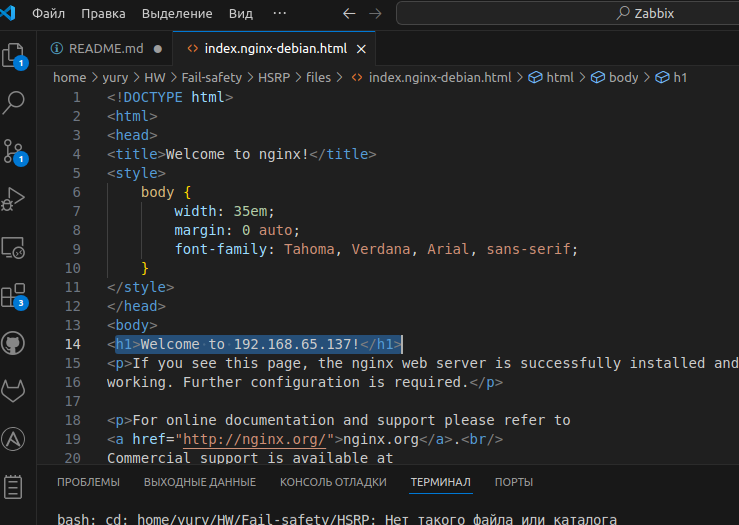
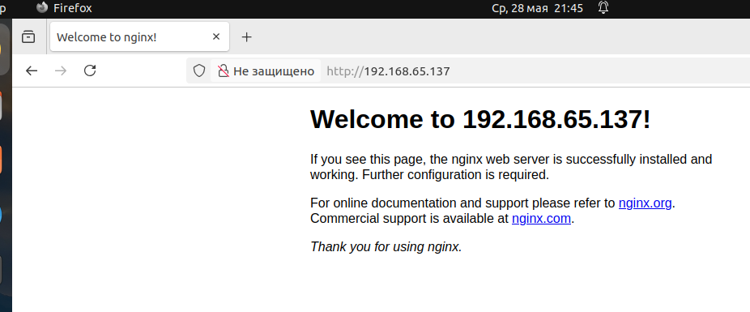

# Домашнее задание к занятию 1 «Disaster recovery и Keepalived» Шелухин Юрий

### Цель задания
В результате выполнения этого задания вы научитесь:
1. Настраивать отслеживание интерфейса для протокола HSRP;
2. Настраивать сервис Keepalived для использования плавающего IP

---

### Чеклист готовности к домашнему заданию

1. Установлена программа Cisco Packet Tracer
2. Установлена операционная система Ubuntu на виртуальную машину и имеется доступ к терминалу
3. Сделан клон этой виртуальной машины, они находятся в одной подсети и имеют разные IP адреса
4. Просмотрены конфигурационные файлы, рассматриваемые на лекции, которые находятся по [ссылке](1/)

---

### Задание 1
- Дана [схема](1/hsrp_advanced.pkt) для Cisco Packet Tracer, рассматриваемая в лекции.
- На данной схеме уже настроено отслеживание интерфейсов маршрутизаторов Gi0/1 (для нулевой группы)
- Необходимо аналогично настроить отслеживание состояния интерфейсов Gi0/0 (для первой группы).
- Для проверки корректности настройки, разорвите один из кабелей между одним из маршрутизаторов и Switch0 и запустите ping между PC0 и Server0.
- На проверку отправьте получившуюся схему в формате pkt и скриншот, где виден процесс настройки маршрутизатора.

---

# Решение 1
1. Настроим интерфейс маршрутизаторов (роутеров) 1 и 2 первой группы, изменим приоритетность на 95 на первом роутере. В этом случае по умолчанию ping от сервера будет проходить через роутер 2, так как у него приоритет выставлен по умолчанию (100).  
     
  

2. Проверим работу схемы. Все ок.  
 

3.  Разорвем кабель между Switch0 и роутером 1, проверим ping между PC0 и Server0. Приоритет у роутера 2 выше (100), поэтому ping проходит через него.  
  

4.  Разорвем кабель между Switch0 и роутером 2, проверим ping между PC0 и Server0. Приоритет у роутера 2 автоматически снизился на 10 единиц, до 90. Приоритет у роутера 1 выше (95), поэтому ping проходит через него.  
 

[схема](scheme/task_1.pkt)

Для настройки использована информация сайта http://xgu.ru/wiki/HSRP_в_Cisco 

---

### Задание 2
- Запустите две виртуальные машины Linux, установите и настройте сервис Keepalived как в лекции, используя пример конфигурационного [файла](1/keepalived-simple.conf).
- Настройте любой веб-сервер (например, nginx или simple python server) на двух виртуальных машинах
- Напишите Bash-скрипт, который будет проверять доступность порта данного веб-сервера и существование файла index.html в root-директории данного веб-сервера.
- Настройте Keepalived так, чтобы он запускал данный скрипт каждые 3 секунды и переносил виртуальный IP на другой сервер, если bash-скрипт завершался с кодом, отличным от нуля (то есть порт веб-сервера был недоступен или отсутствовал index.html). Используйте для этого секцию vrrp_script
- На проверку отправьте получившейся bash-скрипт и конфигурационный файл keepalived, а также скриншот с демонстрацией переезда плавающего ip на другой сервер в случае недоступности порта или файла index.html

---

# Решение 2
1. Запустим 2 виртуальные машины (192.168.65.136, 192.168.65.137), установим на них Keepalived, настроим конфигурационные файлы. Проверим работу сервисов, проверим резирвировование виртуального адреса (192.168.65.100) на ВМ - master.  
     
 
     
  
     
 

2. Установим nginx  на обеих ВМ, изменим текст страницы по умолчанию, чтобы было понятно к какому серверу получен доступ (ip).  

3. Проверим доступность серверов nginx по всем 3-ем адресам.  
     
 

4. Создадим bash-скрипт, укажем его в конфигурационном файле Keepalived. После рестарта выявлено, что скрипт не запускается, так как файл не исполняемый, а ползователь не назначен.    

5. Дополним конфигурационный файл блоком глобальных настроек с указанием пользователя скрипта, а также помменяем права на скрипт.    

6. Перезапустим Keepalived на обеих ВМ, проверим статус.
 

7. Удалим  файл index.nginx-debian.html с ВМ-Master (192.168.65.137), проверим работу скрипта, запустив его через терминал  

 

8. Проверим перенос виртуалтьного IP (192.168.65.100) на другой сервер (192.168.65.136)  
 

9. Использованы следующие файлы стартовой страницы сервера, конфигурации и скрипта.  
[страница nginx](files/index.nginx-debian.html)  
[конфигурационный файл](files/keepalived.conf)  
[скрипт](files/ppcheck.sh)

---